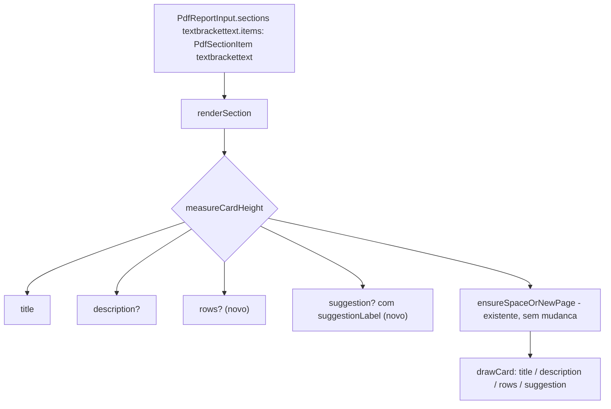

> Constitution aplicável: nenhuma — `kbr-pdf-service` não tem constitution própria.
> Spec base: [spec.md](./spec.md) (aprovada 2026-09-19)

# Plan — Linhas de duas colunas e rótulo customizável no card de item (`PdfSectionItem`)

## Visão arquitetural

A extensão vive inteiramente dentro de `@kbr/pdf-service`, em dois arquivos:
o contrato de tipos (`types.ts`) e o renderer de seção (`sections/section-renderer.ts`).
Nenhum outro módulo do pacote (`pdf-builder.ts`, `processing/`, tema) precisa
mudar — `renderSection` já recebe o `PdfSectionItem` inteiro e já implementa
a medição de altura + `ensureSpaceOrNewPage` antes de desenhar; os dois campos
novos só entram como mais uma fonte de altura e mais um texto a desenhar
dentro do mesmo fluxo existente.



## Componentes e consumidores impactados

| Componente | Mudança | Impacto |
| --- | --- | --- |
| `types.ts` | novo tipo `PdfItemRow { label: string; value: string }`; `PdfSectionItem` ganha `rows?: PdfItemRow[]` e `suggestionLabel?: string` | contrato público do pacote (aditivo) |
| `sections/section-renderer.ts` | `measureCardHeight`/render soma altura de `rows` (uma linha por item, rótulo esquerda/valor direita); bloco `suggestion` usa `item.suggestionLabel ?? 'SUGGESTION'` no lugar do literal fixo | único ponto de renderização de cards |
| `__tests__/layout-components.test.ts` (ou novo arquivo) | novos casos cobrindo `rows`/`suggestionLabel` + regressão do comportamento sem eles | suíte do próprio pacote |
| `CHANGELOG.md` | entrada documentando a extensão aditiva | nenhum impacto funcional |
| `kbr-domain-billing`, `kbr-domain-dealers-commissions` | **nenhuma mudança de código** — apenas consumidores que continuam funcionando sem os campos novos | verificação de não regressão (fora desta implementação, checagem recomendada pós-merge) |

## Fluxo proposto

1. Consumidor monta `PdfSectionItem` com `rows`/`suggestionLabel` opcionais
   (ou omite, comportamento atual).
2. `renderSection` mede a altura do card somando: título, `description`
   (se houver), altura de cada `PdfItemRow` (se `rows` presente), bloco
   `suggestion` (se houver).
3. `ensureSpaceOrNewPage` roda com a altura total antes de desenhar — sem
   mudança nesta função.
4. Desenho: título → `description` → linhas de `rows` (label esquerda,
   value alinhado à direita da largura útil do card) → bloco `suggestion`
   com o rótulo resolvido (`item.suggestionLabel ?? 'SUGGESTION'`).

## Limites entre camadas

- `types.ts` só declara forma de dado — nenhuma lógica de formatação mora
  ali (ex.: não formata moeda; `value` já chega formatado do consumidor,
  como já é hoje para `description`).
- `section-renderer.ts` é o único lugar que sabe desenhar — nenhum outro
  arquivo do pacote passa a conhecer `rows`/`suggestionLabel`.
- Consumidores (`billing`, `dealers-commissions`) não são tocados por este
  plan — eles decidem *se* e *quando* adotam os campos novos em specs
  próprias (demanda 3, já identificada, fora deste plan).

## Contratos técnicos

### `types.ts`

```ts
export interface PdfItemRow {
  label: string;
  value: string;
}

export interface PdfSectionItem {
  title: string;
  description?: string;
  rows?: PdfItemRow[];       // novo
  suggestion?: string;
  suggestionLabel?: string;  // novo — default 'SUGGESTION' quando ausente
  file?: string;
  line?: number;
  severity?: string;
}
```

### `sections/section-renderer.ts` (pontos de mudança)

```ts
// medição de altura — soma de mais uma parcela
let cardHeight = /* título + description já existentes */;
if (item.rows?.length) {
  cardHeight += item.rows.reduce(
    (sum, row) => sum + measureTextHeight(doc, `${row.label} ${row.value}`, fonts.regular, fontSizes.body, rowWidth),
    0,
  );
}
// suggestion já soma sua altura — sem mudança de cálculo, só de rótulo

// desenho — rows entre description e suggestion
if (item.rows?.length) {
  for (const row of item.rows) {
    doc.text(row.label, cardX, cursorY, { width: labelWidth, continued: false });
    doc.text(row.value, cardX, cursorY, { width: rowWidth, align: 'right' });
    cursorY += measureTextHeight(doc, `${row.label} ${row.value}`, fonts.regular, fontSizes.body, rowWidth);
  }
}

// bloco suggestion — troca do literal fixo pelo rótulo resolvido
const label = item.suggestionLabel ?? 'SUGGESTION';
doc.text(label, blockX + innerOffset, blockY, { characterSpacing: 0.6, lineBreak: false });
```

## Decisões e justificativas

- **[DECIDIDO]** `rows`/`suggestionLabel` opcionais, sem valor default
  forçado em `types.ts` — `undefined` preserva 100% do comportamento atual
  (RN001 da spec).
- **[DECIDIDO]** `PdfItemRow` é um tipo próprio (não reaproveita
  `PdfTableColumn`/`PdfTableRow`) — layout de card é conceitualmente
  diferente de tabela (sem cabeçalho, sem múltiplas colunas), reaproveitar o
  tipo de tabela obrigaria a preencher campos que não fazem sentido aqui
  (`width` relativo, `columns[]`).
- **[DECIDIDO]** `value` chega como `string` já formatada pelo consumidor
  (mesmo padrão de `description` hoje) — a biblioteca não formata moeda/data,
  evita acoplar `@kbr/pdf-service` a regra de formatação de domínio.
- **[DECIDIDO]** Sem migração/versionamento de schema — é uma lib TypeScript,
  não há dado persistido; o único "consumidor" de `types.ts` é o compilador
  dos repositórios que importam o pacote.
- **[DECIDIDO]** Branch de feature (`feature/pdf-item-rows-suggestion-label`)
  a partir de `main`, PR revisado antes do merge — decisão do usuário na
  spec, dado o impacto em dois domínios consumidores via dependência de git
  pinada em branch (sem tag/versão).
- **[HIPÓTESE]** A largura disponível para `rows` (label + value) é a mesma
  largura útil do card já usada por `description` — não há motivo aparente
  para ser diferente, mas só confirmável olhando o cálculo real de
  `cardWidth`/margens no código durante a implementação (TDD visual via
  buffer de teste, não é possível confirmar por leitura estática sozinha).

## Riscos e mitigação

- **Risco**: `kbr-domain-billing` ter algum teste de snapshot binário do PDF
  que quebre por qualquer motivo não relacionado (flakiness pré-existente).
  Mitigação: mudança é 100% aditiva (RN001/INV001/INV002 da spec); rodar a
  suíte de `billing` após o merge é checagem recomendada, não bloqueante
  desta implementação.
- **Risco**: `main` sem proteção de branch, merge direto disponível.
  Mitigação: branch de feature + PR revisado antes do merge (decisão já
  tomada na spec).

## Ordem de implementação sugerida

1. `types.ts` — novos tipos, sem lógica.
2. `sections/section-renderer.ts` — `rows` (medição + desenho) e
   `suggestionLabel` (troca do literal fixo).
3. Testes (`__tests__/`) — regressão (CA001, CA005) + casos novos
   (CA002-CA004, CA006).
4. `CHANGELOG.md`.
