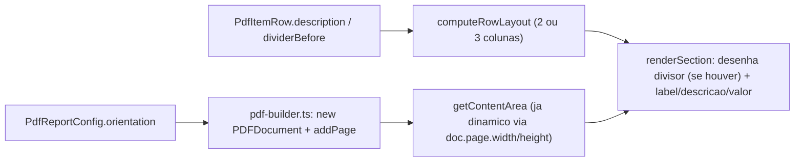

> Constitution aplicável: nenhuma (biblioteca de infraestrutura, ver spec.md).
> Spec base: [spec.md](./spec.md) (aprovada 2026-09-20)

# Plan — Terceira coluna, divisor e orientação de página em `@kbr/pdf-service`

## Visão arquitetural

Três extensões independentes e aditivas ao mesmo pipeline de renderização
(`buildPdf` → `renderSection` → 1 card por `PdfSectionItem` → N `PdfItemRow`):

1. **3ª coluna (descrição)** — `computeRowLayout`/`measureRowHeight`/laço de
   desenho de `item.rows` em `section-renderer.ts` passam a considerar
   `row.description` quando presente, recalculando 3 larguras de coluna em
   vez de 2 (label mais estreito, coluna de descrição no meio).
2. **Divisor** — antes de desenhar uma linha com `row.dividerBefore: true`,
   desenha um traço horizontal (mesmo estilo do separador do footer,
   `colors.n100LightGray`, `lineWidth: 0.5`) e soma a altura do traço + gap
   extra na medição de altura do card (`measureRowHeight`/loop de desenho).
3. **Orientação** — `pdf-builder.ts` passa `layout: config.orientation ??
   'portrait'` na criação do `PDFDocument` e em cada `doc.addPage()`. Como
   `getContentArea`/`renderPageHeader`/`renderPageFooter` já leem
   `doc.page.width`/`doc.page.height` dinamicamente (confirmado lendo
   `page-chrome.ts`), nenhuma outra mudança é necessária para o conteúdo se
   adaptar à nova largura/altura.



## Componentes e consumidores impactados

| Componente | Mudança | Impacto |
| --- | --- | --- |
| `types.ts` | `PdfItemRow` ganha `description?: string`, `dividerBefore?: boolean`; `PdfReportConfig` ganha `orientation?: 'portrait' \| 'landscape'` | tipos exportados, usados por todos os consumidores |
| `pdf-builder.ts` | `DEFAULT_CONFIG.orientation = 'portrait'`; `new PDFDocument({ ..., layout: config.orientation })`; cada `doc.addPage()` (capa + por seção) passa `{ layout: config.orientation }` | todo PDF gerado (`buildPdf`/`generatePdf`) |
| `sections/section-renderer.ts` | `computeRowLayout` recebe `hasDescription: boolean` (por linha, não por card — RN001) e devolve 3 âncoras de coluna em vez de 2 quando `true`; laço de `item.rows` desenha o traço do divisor antes da linha quando `row.dividerBefore`; `measureRowHeight` soma altura do divisor quando aplicável | qualquer card com `rows` |
| `sections/page-chrome.ts` | **sem mudança** (já dinâmico) | nenhum |
| `components/card.ts` | **sem mudança** (só desenha o retângulo, largura já vem de `area.width`, dinâmica) | nenhum |

## Fluxo proposto

1. `buildPdf` monta `config` com `orientation` (default `'portrait'`) e cria
   o `PDFDocument` com `layout: config.orientation`.
2. Cada `doc.addPage()` (capa + 1 por seção) repete `{ layout:
   config.orientation }` explicitamente — não confiar em herança implícita
   do pdfkit sem validar com uma geração real (ver Riscos/Premissa a
   validar).
3. `renderSection`, para cada `item.rows`, calcula o layout de coluna **por
   linha** (não por card): 2 colunas se `row.description` ausente/vazia, 3
   colunas se presente.
4. Antes de desenhar uma linha com `dividerBefore: true`, desenha um traço
   horizontal na largura útil do card e avança `innerY` pelo espaço do
   traço + gap.
5. Altura do card (`cardHeight`, usada por `ensureSpaceOrNewPage`) soma a
   altura de cada linha (já considerando 2 ou 3 colunas) + altura extra de
   cada divisor.

## Limites entre camadas

- Decisão de layout (2 vs 3 colunas, onde desenhar o divisor) mora
  inteiramente em `section-renderer.ts` — `types.ts` só declara os campos
  opcionais, sem lógica.
- Orientação é resolvida uma única vez em `pdf-builder.ts` (na criação do
  documento); nenhum outro arquivo lê `config.orientation` diretamente.

## Contratos técnicos

### `types.ts`

```ts
export interface PdfItemRow {
  label: string;
  value: string;
  description?: string;   // novo — RF001
  dividerBefore?: boolean; // novo — RF002
}

export interface PdfReportConfig {
  // ...campos existentes inalterados...
  orientation?: 'portrait' | 'landscape'; // novo — RF003, default 'portrait'
}
```

### `pdf-builder.ts`

```ts
const DEFAULT_CONFIG: Required<PdfReportConfig> = {
  // ...campos existentes...
  orientation: 'portrait',
};

const doc = new PDFDocument({
  size: 'A4',
  layout: config.orientation,
  margins: { /* inalterado */ },
  bufferPages: true,
  autoFirstPage: false,
  ...
});
// ...
doc.addPage({ layout: config.orientation }); // capa
// ...
doc.addPage({ layout: config.orientation }); // por secao
```

### `sections/section-renderer.ts`

```ts
interface RowLayout {
  labelWidth: number;
  descriptionX?: number;
  descriptionWidth?: number;
  valueX: number;
  valueWidth: number;
}

/** 2 colunas (label/value) quando sem descricao; 3 quando com (RN001, por linha). */
function computeRowLayout(textWidth: number, hasDescription: boolean): RowLayout {
  const gap = 12;
  if (!hasDescription) {
    const labelWidth = Math.floor(textWidth * 0.55);
    const valueX = labelWidth + gap;
    return { labelWidth, valueX, valueWidth: textWidth - valueX };
  }
  const labelWidth = Math.floor(textWidth * 0.3);
  const descriptionX = labelWidth + gap;
  const descriptionWidth = Math.floor(textWidth * 0.4);
  const valueX = descriptionX + descriptionWidth + gap;
  return { labelWidth, descriptionX, descriptionWidth, valueX, valueWidth: textWidth - valueX };
}

const DIVIDER_HEIGHT = 1;
const DIVIDER_GAP = 6; // acima + abaixo do traço

function measureRowHeight(doc, row: PdfItemRow, fonts, fontSizes, layout: RowLayout): number {
  const labelHeight = measureTextHeight(doc, row.label, fonts.regular, fontSizes.body, layout.labelWidth, 2);
  const descriptionHeight = row.description
    ? measureTextHeight(doc, row.description, fonts.regular, fontSizes.body, layout.descriptionWidth!, 2)
    : 0;
  const valueHeight = measureTextHeight(doc, row.value, fonts.regular, fontSizes.body, layout.valueWidth, 2);
  const contentHeight = Math.max(labelHeight, descriptionHeight, valueHeight);
  return row.dividerBefore ? contentHeight + DIVIDER_HEIGHT + DIVIDER_GAP * 2 : contentHeight;
}

// dentro do laço de desenho de item.rows:
for (const row of item.rows) {
  const layout = computeRowLayout(textWidth, Boolean(row.description));
  const rowHeight = measureRowHeight(doc, row, fonts, fontSizes, layout);

  let rowY = innerY;
  if (row.dividerBefore) {
    doc.save()
      .moveTo(area.x + padding, rowY + DIVIDER_GAP)
      .lineTo(area.x + padding + textWidth, rowY + DIVIDER_GAP)
      .lineWidth(DIVIDER_HEIGHT)
      .strokeColor(colors.n100LightGray)
      .stroke()
      .restore();
    rowY += DIVIDER_GAP * 2 + DIVIDER_HEIGHT;
  }

  doc.save().font(fonts.regular).fillColor(colors.n800Charcoal)
    .text(row.label, area.x + padding, rowY, { width: layout.labelWidth, lineGap: 2 })
    .restore();

  if (row.description) {
    doc.save().font(fonts.regular).fillColor(colors.n600DarkElectricBlue)
      .text(row.description, area.x + padding + layout.descriptionX!, rowY, { width: layout.descriptionWidth!, lineGap: 2 })
      .restore();
  }

  doc.save().font(fonts.regular).fillColor(colors.n800Charcoal)
    .text(row.value, area.x + padding + layout.valueX, rowY, { width: layout.valueWidth, align: 'right', lineGap: 2 })
    .restore();

  innerY = rowY + rowHeight + spacing.itemRowGap - (row.dividerBefore ? DIVIDER_HEIGHT + DIVIDER_GAP * 2 : 0);
}
```

## Decisões e justificativas

- **[DECIDIDO]** Layout de coluna (2 vs 3) é decidido **por linha**, não
  por card (RN001 da spec) — permite Duração total (3 col) e Veículo Kinto
  (2 col) no mesmo card, exatamente o caso de uso do consumidor.
- **[DECIDIDO]** Descrição usa `colors.n600DarkElectricBlue` (mesma cor já
  usada para texto secundário no header/rodapé) para se diferenciar
  visualmente do label/valor (`n800Charcoal`) sem introduzir uma cor nova
  no theme.
- **[DECIDIDO]** Divisor reaproveita o padrão visual já existente no
  footer (`colors.n100LightGray`, linha fina) em vez de criar um novo
  token de cor — consistência visual sem mudar `theme.ts`.
- **[DECIDIDO]** Orientação é resolvida 1x na criação do `PDFDocument` e
  repassada em todo `doc.addPage()` — não depender de o pdfkit herdar
  `layout` implicitamente (risco identificado na spec); validar com teste
  de geração real antes de finalizar (VER da verification.md).
- **[HIPÓTESE]** pdfkit aceita `layout` tanto na constructor quanto em
  `addPage()` sem exigir também recalcular `size` a cada chamada — a
  confirmar em VER (teste real, não assumir da doc do pdfkit).

## Riscos e mitigação

- **Risco**: se pdfkit não repassar `layout` para `doc.page.width/height`
  como esperado, todo o cálculo dinâmico de `getContentArea` fica errado
  silenciosamente (sem erro, só layout visualmente quebrado). Mitigação:
  VER dedicado gera um PDF real em paisagem e mede `doc.page.width` via
  buffer/parse básico (ou inspeção visual) antes de aceitar a hipótese.
- **Risco**: subtrair a altura do divisor de volta em `innerY` (para não
  contar 2x, já que `rowHeight` também inclui o divisor) é uma conta fácil
  de errar e gerar card mais alto/baixo que o necessário. Mitigação: TDD
  de `measureRowHeight`/altura total do card cobrindo linha com e sem
  divisor.

## Ordem de implementação sugerida

1. `types.ts` — campos novos opcionais (sem lógica).
2. `sections/section-renderer.ts` — `computeRowLayout`/`measureRowHeight`
   com 3 colunas + divisor (TDD isolado, sem `pdf-builder.ts`).
3. `pdf-builder.ts` — orientação (`layout` na constructor + `addPage`).
4. Teste de regressão end-to-end (PDF completo, retrato, sem os campos
   novos) confirmando byte-identidade/estrutura equivalente ao
   comportamento atual (INV001).
